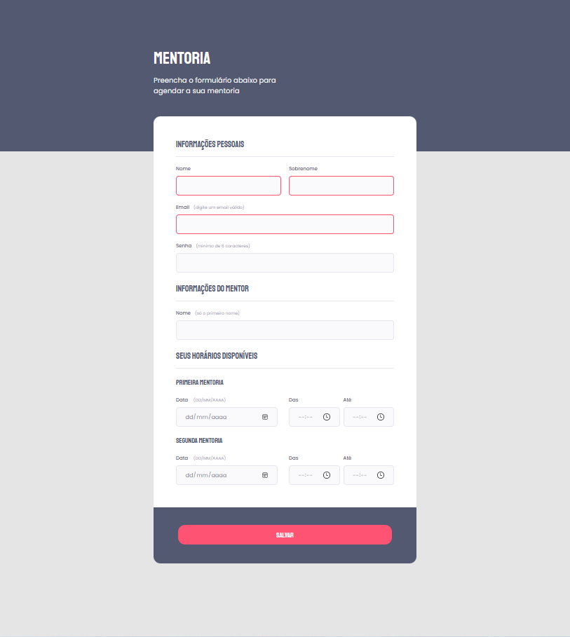

<h1 align="center"> Formulário Intermediário </h1>

  <a href="#-tecnologias">Tecnologias</a>&nbsp;&nbsp;&nbsp;|&nbsp;&nbsp;&nbsp;
  <a href="#-projeto">Projeto</a>&nbsp;&nbsp;&nbsp;|&nbsp;&nbsp;&nbsp;
  <a href="#-layout">Layout</a>&nbsp;&nbsp;&nbsp;|&nbsp;&nbsp;&nbsp;
  <a href="#memo-licença">Licença</a>

 

  

## 🛠 Tecnologias

Esse projeto foi desenvolvido com as seguintes tecnologias:

- HTML e CSS
- Git e Github
- Figma

## 💻 Projeto

  
 Nesse módulo foi proposto recriar uma aplicação, a partir de um layout pronto no Figma, para fortalecer alguns conceitos aprendidos nessa aula, entre eles:

- Estilos de página;
- Agrupamentos de campos com fieldset e legend;
- Formatação e ajuste de campos do fieldset;
- Estilos para o submit;
- Validação de campos e submetendo fomulários.

  

## 🎨 Layout

Você pode visualizar o layout do projeto, é necessário ter conta no [Figma](https://figma.com) para acessá-lo.   

## :memo: Licença

Esse projeto está sob a licença MIT:  

---
<h4 align="center">
  Feito com ❤️ por <a href="https://www.linkedin.com/in/rogerio-mamoni/">Rogério Mamoni</a>
  

</h4>
